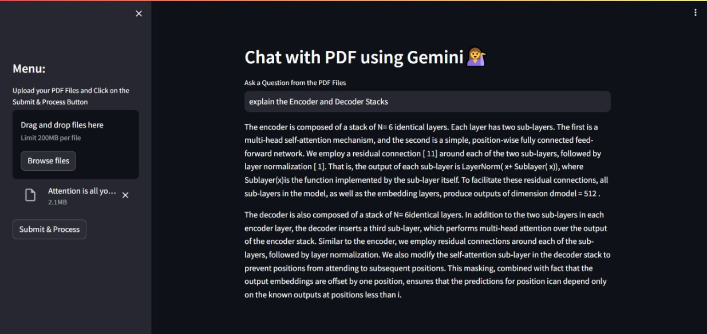

# CHAT with PDF using Gemini
## Overview
This project leverages the Gemini Pro LLM model, LanguageChain, Streamlit, and Python to create a system for interacting with PDF documents through a chat-based interface. Users can engage in natural language conversations to extract information from PDF files, enhancing document interaction.

## Tech Stack
- [Gemini Pro LLM model](https://ai.google.dev/tutorials/python_quickstart)
- LanguageChain
- [Streamlit](https://streamlit.io/)
- Python

## Getting Started
### API Key Setup
To use the Gemini Pro LLM model, you need to obtain an API key. Follow these steps to acquire your key:
1. Visit [Gemini Makersuite](https://makersuite.google.com/app/prompts/new_freeform).
2. Complete the necessary information to request an API key.
3. Once approved, you will receive your API key for accessing the Gemini Pro LLM model.

## Installation
1. Clone the repository:

   
       git clone https://github.com/rrpatil-1/LLM/tree/main/CHAT_WITH_PDF_USING_GEMINI

2. Navigate to the project directory:
   
3. Install the required dependencies:
   

       pip install -r requirements.txt

### Usage
1. Replace <b>YOUR_API_KEY</b> in the code with the API key obtained from the Gemini Makersuite. 
   
2. Set your Gemini API key  in .env file 

      GOOGLE_API_KEY = "YOUR_API_KEY"

3. Run the Streamlit app:

   
    streamlit run app.py
   
3. Open your browser and go to http://localhost:8501 to interact with the chat interface.

## User Interface

### Additional Notes
Make sure to handle sensitive information like API keys securely and avoid sharing them publicly.
Refer to Gemini Pro LLM documentation for detailed usage guidelines and features.
Feel free to explore and enhance the project according to your requirements! If you encounter any issues or have suggestions, please open an issue on the project's GitHub repository.
